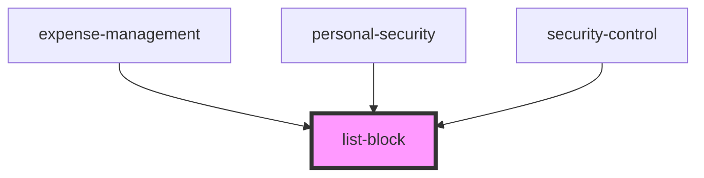

# list-block

<!-- Auto Generated Below -->

## Properties

| Property | Attribute | Description | Type    | Default     |
| -------- | --------- | ----------- | ------- | ----------- |
| `text`   | --        |             | `any[]` | `undefined` |
| `titl`   | --        |             | `any[]` | `undefined` |

## Dependencies

### Used by

 - [expense-management](../res/view/expense-management)
 - [personal-security](../res/view/personal-security)
 - [security-control](../res/view/security-control)

### Graph

----------------------------------------------

*Built with [StencilJS](https://stenciljs.com/)*
