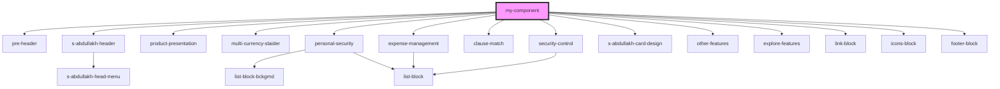

# my-component

<!-- Auto Generated Below -->

## Dependencies

### Depends on

- [pre-header](../res/view/pre-header)
- [s-abdullakh-header](../res/view/s-abdullakh-header)
- [product-presentation](../res/view/product-presentation)
- [multi-currency-slaider](../res/view/multi-currency-slaider)
- [personal-security](../res/view/personal-security)
- [expense-management](../res/view/expense-management)
- [clause-match](../res/view/clause-match)
- [security-control](../res/view/security-control)
- [s-abdullakh-card-design](../res/view/s-abdullakh-card-design)
- [other-features](../res/view/other-features)
- [explore-features](../res/view/explore-features)
- [link-block](../res/view/link-block)
- [icons-block](../res/view/icons-block)
- [footer-block](../res/view/footer-block)

### Graph

----------------------------------------------

*Built with [StencilJS](https://stenciljs.com/)*
