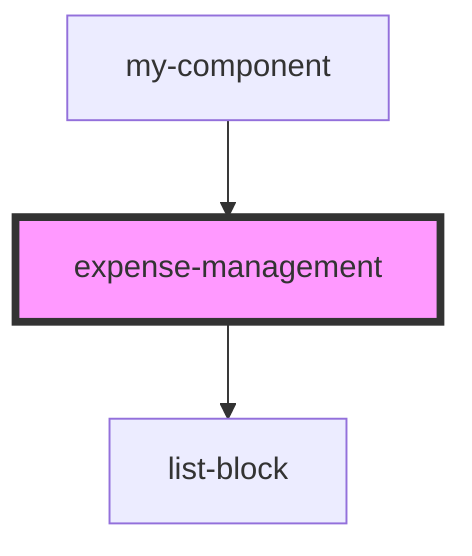

# expense-management

<!-- Auto Generated Below -->

## Dependencies

### Used by

 - [my-component](../../../my-component)

### Depends on

- [list-block](../../../list_block)

### Graph

----------------------------------------------

*Built with [StencilJS](https://stenciljs.com/)*
