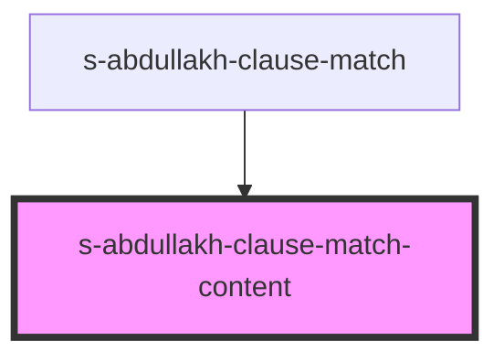

# s-abdullakh-clause-match-content

<!-- Auto Generated Below -->

## Properties

| Property      | Attribute      | Description | Type  | Default     |
| ------------- | -------------- | ----------- | ----- | ----------- |
| `clauseMatch` | `clause-match` |             | `any` | `undefined` |

## Events

| Event                | Description | Type               |
| -------------------- | ----------- | ------------------ |
| `clickOnClauseMatch` |             | `CustomEvent<any>` |

## Dependencies

### Used by

 - [s-abdullakh-clause-match](../../..)

### Graph

----------------------------------------------

*Built with [StencilJS](https://stenciljs.com/)*
