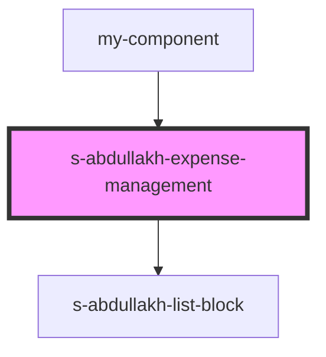

# expense-management

<!-- Auto Generated Below -->

## Properties

| Property               | Attribute                | Description             | Type     | Default     |
| ---------------------- | ------------------------ | ----------------------- | -------- | ----------- |
| `expenseManagement`    | `expense-management`     | массив personalSecurity | `any`    | `undefined` |
| `expenseManagementImg` | `expense-management-img` | массив personalSecurity | `string` | `undefined` |

## Events

| Event                      | Description | Type               |
| -------------------------- | ----------- | ------------------ |
| `clickOnExpenseManagement` |             | `CustomEvent<any>` |

## Dependencies

### Used by

 - [my-component](../../../my-component)

### Depends on

- [s-abdullakh-list-block](../../../s-abdullakh-list-block)

### Graph

----------------------------------------------

*Built with [StencilJS](https://stenciljs.com/)*
