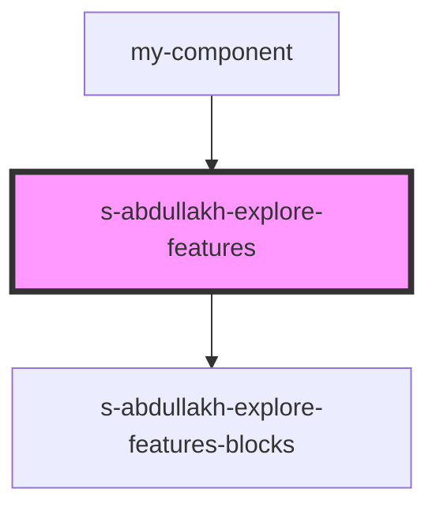

# explore-features

<!-- Auto Generated Below -->

## Properties

| Property          | Attribute          | Description | Type  | Default     |
| ----------------- | ------------------ | ----------- | ----- | ----------- |
| `exploreFeatures` | `explore-features` |             | `any` | `undefined` |

## Events

| Event                   | Description                        | Type               |
| ----------------------- | ---------------------------------- | ------------------ |
| `clickOnExploreFeature` | клик по в компоненте NewSinglePost | `CustomEvent<any>` |

## Dependencies

### Used by

 - [my-component](../../../my-component)

### Depends on

- [s-abdullakh-explore-features-blocks](res/view/s-abdullakh-explore-features-blocks)

### Graph

----------------------------------------------

*Built with [StencilJS](https://stenciljs.com/)*
