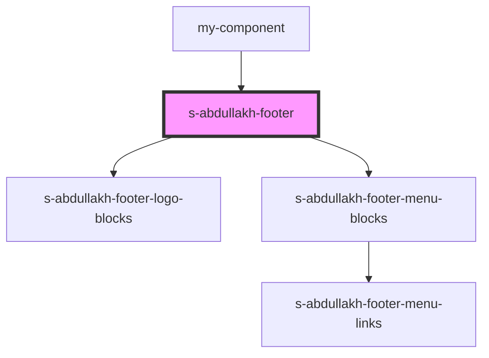

# footer-block

<!-- Auto Generated Below -->

## Properties

| Property | Attribute | Description | Type    | Default     |
| -------- | --------- | ----------- | ------- | ----------- |
| `footer` | --        |             | `any[]` | `undefined` |

## Dependencies

### Used by

 - [my-component](../../../my-component)

### Depends on

- [s-abdullakh-footer-logo-blocks](./res/view/s-abdullakh-footer-logo-blocks)
- [s-abdullakh-footer-menu-blocks](./res/view/s-abdullakh-footer-menu-blocks)

### Graph

----------------------------------------------

*Built with [StencilJS](https://stenciljs.com/)*
