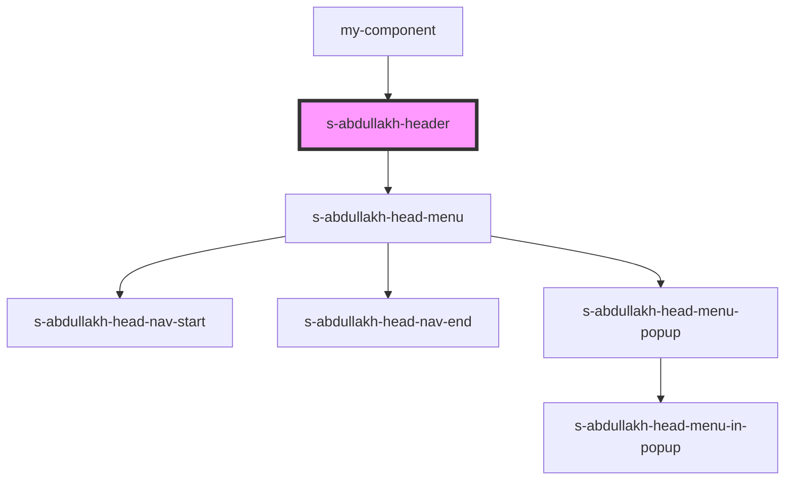

# s-abdullakh-header

<!-- Auto Generated Below -->

## Properties

| Property   | Attribute   | Description | Type    | Default     |
| ---------- | ----------- | ----------- | ------- | ----------- |
| `headNav`  | --          | массив меню | `any[]` | `undefined` |
| `headText` | `head-text` | массив меню | `any`   | `undefined` |

## Events

| Event           | Description | Type               |
| --------------- | ----------- | ------------------ |
| `clickOnHeader` | массив меню | `CustomEvent<any>` |

## Dependencies

### Used by

 - [my-component](../../../my-component)

### Depends on

- [s-abdullakh-head-menu](./res/view/s-abdullakh-head-menu)

### Graph

----------------------------------------------

*Built with [StencilJS](https://stenciljs.com/)*
