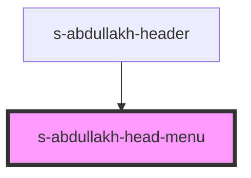

# s-abdullakh-head-menu

<!-- Auto Generated Below -->

## Properties

| Property  | Attribute | Description | Type    | Default     |
| --------- | --------- | ----------- | ------- | ----------- |
| `headNav` | --        |             | `any[]` | `undefined` |

## Dependencies

### Used by

 - [s-abdullakh-header](../../..)

### Graph

----------------------------------------------

*Built with [StencilJS](https://stenciljs.com/)*
