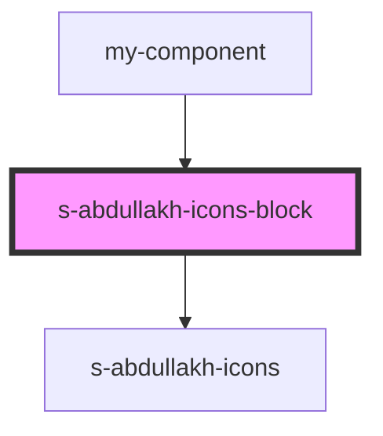

# icons-block

<!-- Auto Generated Below -->

## Properties

| Property            | Attribute            | Description                                               | Type  | Default     |
| ------------------- | -------------------- | --------------------------------------------------------- | ----- | ----------- |
| `previewBackground` | `preview-background` | props принятия данных для компонента SAbdullakhIconsBlock | `any` | `undefined` |

## Events

| Event               | Description                        | Type               |
| ------------------- | ---------------------------------- | ------------------ |
| `clickOnIconsBlock` | клик по в компоненте NewSinglePost | `CustomEvent<any>` |

## Dependencies

### Used by

 - [my-component](../../../my-component)

### Depends on

- [s-abdullakh-icons](s-abdullakh-icons)

### Graph

----------------------------------------------

*Built with [StencilJS](https://stenciljs.com/)*
