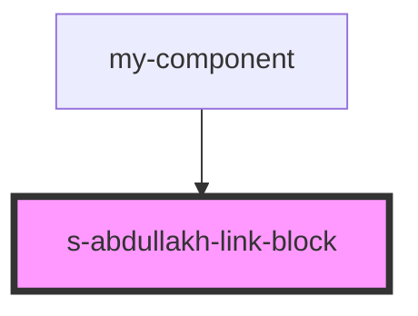

# link-block

<!-- Auto Generated Below -->

## Properties

| Property    | Attribute    | Description | Type  | Default     |
| ----------- | ------------ | ----------- | ----- | ----------- |
| `linkBlock` | `link-block` |             | `any` | `undefined` |

## Events

| Event              | Description                        | Type               |
| ------------------ | ---------------------------------- | ------------------ |
| `clickOnLinkBlock` | клик по в компоненте NewSinglePost | `CustomEvent<any>` |

## Dependencies

### Used by

 - [my-component](../../../my-component)

### Graph

----------------------------------------------

*Built with [StencilJS](https://stenciljs.com/)*
