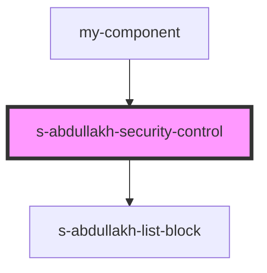

# security-control

<!-- Auto Generated Below -->

## Properties

| Property             | Attribute              | Description             | Type     | Default     |
| -------------------- | ---------------------- | ----------------------- | -------- | ----------- |
| `securityControl`    | `security-control`     | массив personalSecurity | `any`    | `undefined` |
| `securityControlImg` | `security-control-img` | массив personalSecurity | `string` | `undefined` |

## Events

| Event                    | Description | Type               |
| ------------------------ | ----------- | ------------------ |
| `clickOnSecurityControl` |             | `CustomEvent<any>` |

## Dependencies

### Used by

 - [my-component](../../../my-component)

### Depends on

- [s-abdullakh-list-block](../../../s-abdullakh-list-block)

### Graph

----------------------------------------------

*Built with [StencilJS](https://stenciljs.com/)*
