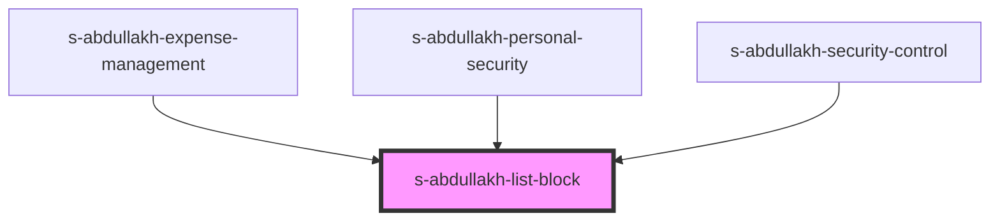

# list-block

<!-- Auto Generated Below -->

## Properties

| Property | Attribute | Description      | Type  | Default     |
| -------- | --------- | ---------------- | ----- | ----------- |
| `arr`    | `arr`     | массив ListBlock | `any` | `undefined` |

## Events

| Event                      | Description | Type               |
| -------------------------- | ----------- | ------------------ |
| `clickOnExpenseManagement` |             | `CustomEvent<any>` |
| `clickOnPersonalSecurity`  |             | `CustomEvent<any>` |

## Dependencies

### Used by

 - [s-abdullakh-expense-management](../res/view/s-abdullakh-expense-management)
 - [s-abdullakh-personal-security](../res/view/s-abdullakh-personal-security)
 - [s-abdullakh-security-control](../res/view/s-abdullakh-security-control)

### Graph

----------------------------------------------

*Built with [StencilJS](https://stenciljs.com/)*
